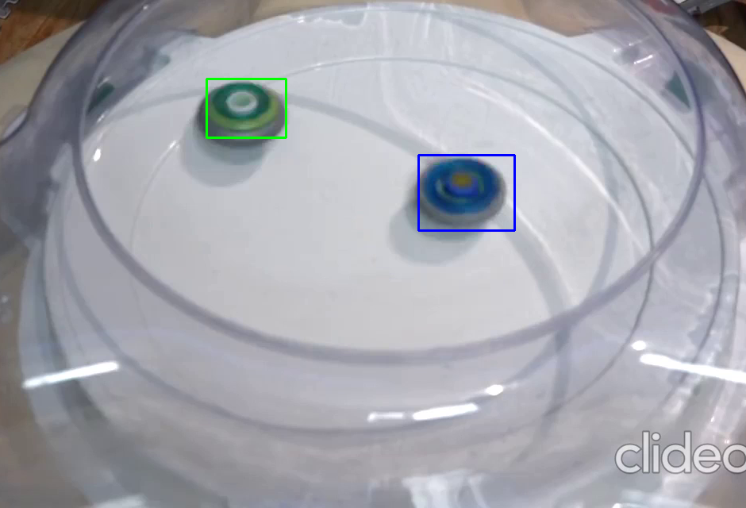

# Beyblade Detection

## This project detects two beyblades as they move around, creating a bounding box around them.

### This was done using OpenCV, with the following steps:
> * First, the appropriate BGR values for the two beyblades were found using a color trackbar (commented out)
> * Masks were created using the values and then by using a bitwise and operation, the beyblades were singled out (Two videos, each showing only one of the beyblades)
> * Then the two videos were merged using a bitwise xor operation which resulted in the inclusion of both beybaldes in the video
> * We do a dilation operation to thicken the edges and then do a canny edge detection
> * For the contour detection, we apply the findContours function on the video frames (after canny edge detection) and do drawContours on a blank image
> * We take the area of each contour and set a threshold area value to avoid the drawing of smaller contours other than the beyblades
> * Then we create a bounding box around each of the beyblades, since one of them is a bit smaller, we use an if statement to check the area of bounding box and draw each of the boxes with different colours, so that the beyblades are differentiated
> * And then we just display the video
